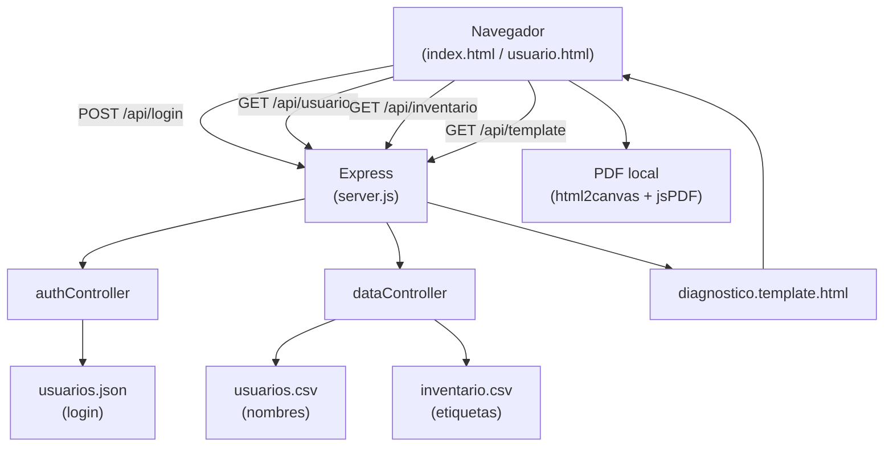

# Plan: Aplicativo Web Diagnóstico en Sitio

## Observaciones de los archivos adjuntos

- **`usuarios.csv`**: delimitador `;`, encabezados `Cedula;Nombre Usuario`, ~12.000 filas reales. Se copiará a `/backend/data/usuarios.csv`.
- **`inventario.csv`**: delimitador `;`, encabezados `Nº serie;Etiqueta`, ~12.000 filas reales. Se copiará a `/backend/data/inventario.csv`.
- **`Plantilla Diagnostico.xlsx`**: se analizará al iniciar la implementación (lectura del XML interno del XLSX) para reproducir fielmente colores, logotipos, tablas y distribución de secciones en `diagnostico.template.html`.
- **Workspace**: directorio vacío — se creará toda la estructura desde cero.

---

## Estructura final de archivos

```
/
├── front/
│   ├── pages/
│   │   ├── index.html            ← login
│   │   ├── index.module.css
│   │   ├── usuario.html          ← app principal
│   │   └── usuario.module.css
│   ├── css/
│   │   └── global.css            ← reset, variables, banner, footer
│   ├── js/
│   │   ├── index.js              ← login + toast
│   │   └── usuario.js            ← formulario, autocompletado, PDF
│   └── assets/
│       └── (logo1–logo5.png, mapeados como placeholders)
├── backend/
│   ├── server.js
│   ├── routes/
│   │   ├── auth.js               ← POST /api/login
│   │   └── data.js               ← GET /api/usuarios, /api/inventario, /api/template
│   ├── controllers/
│   │   ├── authController.js
│   │   └── dataController.js
│   ├── data/
│   │   ├── usuarios.json         ← credenciales login (admin)
│   │   ├── usuarios.csv          ← autocompletado nombre por cédula
│   │   └── inventario.csv        ← autocompletado etiqueta por serial
│   ├── templates/
│   │   └── diagnostico.template.html
│   └── package.json
├── .env
├── .gitignore
├── render.yaml
├── README.md
└── resumen_chat.md
```

---

## Decisiones técnicas clave

### Backend
- **Express** sirve `/front/` como carpeta estática y expone las rutas `/api/*`.
- **csv-parser** configurado con `separator: ';'` y `mapHeaders: trim` para manejar el separador de punto y coma y la cabecera especial `Nº serie` de inventario.csv.
- **jsonwebtoken** genera un token firmado con `JWT_SECRET` del `.env`; payload: `{ id, usuario, nombreCompleto, correo, rol }`.
- Cada petición a `/api/usuarios` y `/api/inventario` re-lee el CSV del disco (sin caché), permitiendo actualizar los archivos sin reiniciar.
- `/api/template` lee y retorna el HTML de la plantilla como texto plano.
- `usuarios.json` estructura: `[{ id, usuario, contraseña, nombreCompleto, correo, rol }]` — contraseña en texto plano para MVP (documentar upgrade a bcrypt).

### Frontend
- **Sin frameworks** — HTML5, CSS custom properties, JS ES6 módulos.
- **Banner** como función `renderBanner()` reutilizable en ambas páginas, inyectada en un `<header id="banner">`.
- **Toast** como módulo `toast(mensaje, tipo)` usando las variables `--color-*`; auto-descarta en 4 s.
- **Textareas** con auto-resize vía listener `input` que ajusta `style.height`.
- **Autocompletado**:
  - Al `blur` de "Cédula usuario" → `buscarPorCedula(cedula)` → llena "Nombre usuario".
  - Al `blur` de "Serial" → `buscarPorSerial(serial)` → llena "Etiqueta".
  - Si no hay coincidencia: toast informativo con `--color-info`.
- **Mapa Sede ↔ Código** implementado como array de objetos `[{ sede, codigo }]` — el select de Ubicación física es independiente, pero el mapa queda disponible para validaciones futuras.

### Generación de PDF (100% frontend)
Flujo al hacer clic en "Generar":

```
Validar formulario
  ↓ (falla → toast error, detener)
Fetch GET /api/template → HTML string
  ↓
Reemplazar {{placeholder}} con valores del formulario
  ↓ (firma como base64 en )
Insertar HTML en <div id="pdf-render"> (hidden, position:absolute, off-screen)
  ↓
html2canvas(div) → canvas
  ↓
jsPDF → addImage(canvas) → ajuste A4/carta
  ↓
pdf.save("diagnostico_{{cedula}}_{{fecha}}.pdf")
  ↓
Toast éxito
```

CDN en `usuario.html`:
```html
<script src="https://cdnjs.cloudflare.com/ajax/libs/html2canvas/1.4.1/html2canvas.min.js"></script>
<script src="https://cdnjs.cloudflare.com/ajax/libs/jspdf/2.5.1/jspdf.umd.min.js"></script>
```

### Plantilla HTML (`diagnostico.template.html`)
Se genera basada en la estructura del Excel: tabla con logotipos en cabecera, secciones coloreadas, y placeholders tipo `{{sede}}`, `{{fecha}}`, `{{nombreUsuario}}`, `{{serial}}`, `{{etiqueta}}`, `{{firmaBase64}}`, etc.

### Despliegue en Render
- `render.yaml` define un Web Service con `buildCommand: cd backend && npm install` y `startCommand: node backend/server.js`.
- Variables de entorno: `PORT`, `JWT_SECRET` (configurar en el dashboard de Render).

---

## Flujo de datos general



---

## Notas importantes

- El CSV de inventario tiene cabecera `Nº serie` (no `serial`). El controlador mapeará este campo a la propiedad `serial` al construir el array de respuesta.
- El CSV de usuarios tiene cabecera `Nombre Usuario` (con espacio). Se mapeará a `nombreUsuario`.
- Ambos CSVs son reales (~12.000 filas). Los endpoints leen stream y retornan JSON completo; el browser los carga en memoria una sola vez al entrar a `usuario.html`.
- La validación de Etiqueta (exactamente 7 caracteres) se aplica tanto al intentar enviar como al perder foco.
- `usuarios.json` y `usuarios.csv` son **archivos distintos** con propósitos distintos — no se mezclan.
